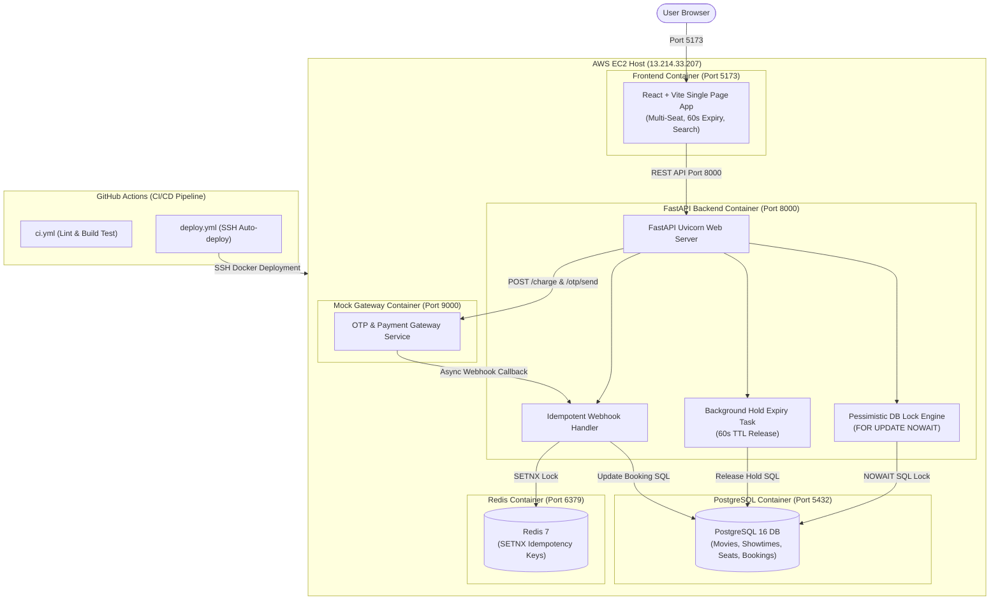

# CinemaSeat — Real-Time High-Concurrency Cinema Ticketing System

CinemaSeat is a production-ready, high-concurrency seat reservation and ticketing web application built with FastAPI, PostgreSQL, Redis, React (Vite), and Docker Compose. It features robust seat locking under intense demand, automated 60-second hold expiries, idempotently processed payment/OTP webhooks, and automated AWS EC2 deployment via GitHub Actions.

---

## 🌐 Deployed Application URLs

* **Frontend Web App:** [http://13.214.33.207:5173](http://13.214.33.207:5173)
* **Backend API Base:** [http://13.214.33.207:8000](http://13.214.33.207:8000)
* **API Documentation (Swagger):** [http://13.214.33.207:8000/docs](http://13.214.33.207:8000/docs)

---

## 🎬 Application Demo & Screen Recording

<p align="center">
  <video src="https://raw.githubusercontent.com/TanimStu068/CinemaSeat/main/demo.mp4" controls width="100%"></video>
</p>

> **Watch the full application walkthrough:** Demonstrating real-time seat map selection (up to 3 seats), 60-second hold timer auto-release, OTP verification & payment webhook processing, and client-side movie search.

---

## 🚀 What Was Built & Feature Matrix

### ✅ What Works
* **High-Concurrency Contention Guarantee:** Handles 100+ concurrent requests for the exact same seat without double-booking. Built with PostgreSQL pessimistic row locks (`SELECT ... FOR UPDATE NOWAIT`).
* **Multi-Seat Booking (Max 3 Seats):** Users can select up to 3 seats in a single checkout session.
* **Automatic Hold Release (60s Expiry):** Reserved seats automatically revert from `HELD` to `AVAILABLE` after 60 seconds if payment is incomplete.
* **Real-time Countdown & Navigation:** Live UI timer on the OTP page with automatic redirect back to seat selection upon expiry.
* **Manual Cancel Hold:** Instant hold cancellation button to immediately free seats.
* **Idempotent Webhooks:** Redis `SETNX` prevents duplicate processing of un-reliable payment and OTP gateway webhooks based on `event_id`.
* **Client-side Movie Search:** Instant real-time movie title and description filtering.
* **Automated CI/CD:** GitHub Actions workflows (`ci.yml` for linting & builds; `deploy.yml` for automated SSH EC2 deployments).

### ⚠️ What Does Not (Scope Constraints)
* **HTTPS/SSL Termination:** Served over HTTP (`5173` and `8000`) for evaluation purposes (no custom domain SSL certificate attached).
* **Live Telephony SMS:** Integrated with the provided mock gateway container (`mock-gateway`) instead of real SMS gateways (e.g., Twilio).

---

## 🏗️ System Architecture



---

## 💻 Local Setup & Execution (Clone to Run)

Follow these exact steps to run the complete stack locally from scratch:

### Prerequisites
* [Docker Desktop](https://www.docker.com/products/docker-desktop/) installed and running.
* `git` installed.

### Step-by-Step Instructions

1. **Clone the Repository:**
   ```bash
   git clone https://github.com/asifmahmoud/cinemaseat.git
   cd cinemaseat
   ```

2. **Set Up Environment Variables:**
   Copy the example environment file:
   ```bash
   cp .env.example .env
   ```

3. **Spin Up Docker Containers:**
   Run Docker Compose in detached mode:
   ```bash
   docker compose up --build -d
   ```

4. **Access the Local Services:**
   * **Frontend Web Application:** [http://localhost:5173](http://localhost:5173)
   * **Backend REST API:** [http://localhost:8000](http://localhost:8000)
   * **Interactive API Docs (Swagger):** [http://localhost:8000/docs](http://localhost:8000/docs)

5. **Stop Containers:**
   ```bash
   docker compose down
   ```

---

## 📡 Key API Requests & cURL Examples

### 1. Fetching a Seat Map
Retrieve all seats and their current statuses (`AVAILABLE`, `HELD`, `BOOKED`) for a specific showtime.

**HTTP Request:**
`GET /showtimes/{showtime_id}/seats`

**cURL Command:**
```bash
curl -X GET "http://13.214.33.207:8000/showtimes/11/seats" \
     -H "Accept: application/json"
```

**Example JSON Response (200 OK):**
```json
[
  {
    "id": 1285,
    "showtime_id": 11,
    "row_label": "A",
    "col_number": 1,
    "status": "AVAILABLE",
    "held_by": null,
    "held_until": null
  },
  {
    "id": 1286,
    "showtime_id": 11,
    "row_label": "A",
    "col_number": 2,
    "status": "HELD",
    "held_by": "user_102",
    "held_until": "2026-08-08T17:35:00.000Z"
  }
]
```

---

### 2. Holding a Seat (Pessimistic Lock Request)
Reserves a seat for a user and starts the 60-second hold timer.

**HTTP Request:**
`POST /seats/{seat_id}/hold`

**cURL Command:**
```bash
curl -X POST "http://13.214.33.207:8000/seats/1285/hold" \
     -H "Content-Type: application/json" \
     -d '{
       "user_id": "user_john_doe",
       "phone": "01700000000"
     }'
```

**Example Successful Response (200 OK):**
```json
{
  "booking_ref": "bk_a8f9c1e2d3b4",
  "message": "Seat held successfully"
}
```

**Example Conflict Response when another user is holding or booking the seat (409 Conflict):**
```json
{
  "detail": "Seat not available"
}
```

---

## 🧪 Proof & Concurrency Scripts

To test heavy concurrent load (100 simultaneous requests) against a single seat:

```bash
# Run concurrency test in container
docker exec cinemaseat-api-1 python /tmp/concurrency_test.py --seat-id 1285 --showtime-id 11 --count 100
```
*Output: Exactly 1 successful hold (200 OK), 99 rejections (409 Conflict), 0 oversells.*
